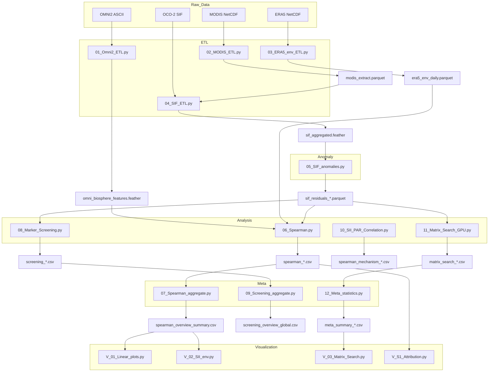

# MAGNETO Pipeline

[](https://doi.org/10.64898/2026.02.17.706448)

> **Paper Reference:** This pipeline was developed for and used in the preparation of the following preprint:
> *Cumulative geomagnetic disturbances modulate global photosystem stoichiometry through temperature-dependent gating* (2026). bioRxiv. DOI: [10.64898/2026.02.17.706448](https://doi.org/10.64898/2026.02.17.706448)

**Magnetosphere–Atmosphere–Geosphere Interaction Network & Ecological Trend Observer**

MAGNETO is a modular geospatial data-processing pipeline designed to quantify
the coupling between geomagnetic activity (SII/Dst), solar forcing (F10.7),
and satellite-derived vegetation fluorescence (SIF), under strict control of
climatic drivers (PAR, VPD, temperature).

All datasets are harmonized to a common 0.5° × 0.5° spatial grid and daily
temporal resolution.

---

## Installation & Environment

The project relies on a specific Python environment managed by Conda. To reproduce the analysis environment:

1. Ensure you have [Anaconda](https://www.anaconda.com/) or [Miniconda](https://docs.conda.io/en/latest/miniconda.html) installed.
2. Create the environment using the provided `environment.yaml` file:

```bash
conda env create -f environment.yaml
```

3. Activate the environment:

```bash
conda activate magneto_env
```

> **Note:** Check the 'name' field in environment.yaml if 'magneto_env' is not the default name.

---

## Computational Resources

The pipeline was executed and tested on the following hardware configuration:

### Tested Environment

- **OS:** Ubuntu 25.10
- **CPU:** 12th Gen Intel(R) Core(TM) i9-12900H
- **RAM:** 46Gi System Memory
- **GPU:** NVIDIA GeForce RTX 3070 Ti Laptop GPU, 8192 MiB
- **Python:** Python 3.11.14

> **Performance Note:** Full pipeline execution (Stage 1–4) takes several hours on this configuration. The pipeline runs entirely in-memory with 44 GB free RAM (swap disabled); users with lower RAM (<32 GB) are advised to enable swap space.

---

## Data Prerequisites

Before running the pipeline, you must acquire the raw datasets and place them in the `data/raw` directory following this exact structure.

**Required Directory Structure:**

```text
data/
└── raw/
    ├── omni2_all_years.zip       # OMNI2 ASCII archive (must contain .dat file)
    ├── MODIS/                    # Folder containing MODIS NetCDF files
    │   └── *.nc                  # e.g., MCD15A2H.006_*.nc
    ├── ERA5/                     # Folder containing ERA5 NetCDF files
    │   └── *.nc                  # Daily/Hourly ERA5 data (t2m, d2m, ssrd, tcc)
    └── OCO2/                     # Folder containing OCO-2 SIF Lite files
        └── oco2_LtSIF_*.nc4      # Daily Lite files (v10 or later)
```

> **Note:** The pipeline handles large datasets. Ensure you have sufficient disk space (at least 400 GB recommended for full processing).

---

## Pipeline Overview

The workflow consists of six major stages:

1. **ETL and Harmonization:** Ingesting raw satellite/station data.
2. **Anomaly Modeling:** Removing seasonal cycles from SIF.
3. **Statistical Analysis:** Correlation, regression, and causality checks.
4. **Meta-Analysis:** Aggregating results across scenarios.
5. **Visualization:** Generating publication-ready figures.
6. **Quality Assurance:** Data auditing and sanity checks.

Global configuration parameters are defined in `_Common.py`.

---

## Data Flow Diagram



---

## Stage 1. ETL and Harmonization

Goal: unify heterogeneous satellite and space-weather datasets.

### 01_Omni2_ETL.py (Space Weather)

- **Input:** `data/raw/omni2_all_years.zip`
- **Output:** `data/interim/omni_biosphere_features.feather`
- **Description:** Extracts SII (–Dst), F10.7, and Kp. Computes moving averages (`_ma`) and discrete lags (`_lag`).

### 02_MODIS_ETL.py (Surface Properties)

- **Input:** `data/raw/MODIS/*.nc`
- **Output:** `data/interim/modis_extract.parquet`
- **Description:** Aggregates LAI, cloud_fraction, aerosol_fraction, and quality_flags to the target grid.

### 03_ERA5_env_ETL.py (Atmosphere)

- **Input:** `data/raw/ERA5/*.nc`
- **Output:** `data/interim/era5_env_daily.parquet`
- **Description:** Processes Temperature (2m), VPD, PAR, and Total Cloud Cover. Uses GPU-accelerated rolling window calculations.

### 04_SIF_ETL.py (Fluorescence Aggregation)

- **Input:** `data/raw/OCO2/*.nc4`, `data/interim/modis_extract.parquet`
- **Output:** `data/interim/sif_aggregated.feather`
- **Description:** Merges SIF points with MODIS environmental flags. Applies Bitwise Region Flagging (SAA, High/Low LAI, Control).

---

## Stage 2. Anomaly Modeling

### 05_SIF_anomalies.py

- **Input:** `data/interim/sif_aggregated.feather`
- **Output:**
  - `data/interim/SIF_model/model_parameters_{target}.feather` (Coefficients)
  - `data/interim/SIF_model/sif_residuals_{target}.parquet` (Time series)
- **Description:** Pixel-wise seasonal decomposition ($y = \alpha t + \beta \cos(t) + \epsilon$). Produces standardized residuals ($Z$-scores) removing phenology.

---

## Stage 3. Statistical Analysis

All analyses combine SIF residuals, ERA5 climate data, and OMNI indices.

### 06_Spearman.py (Base Correlation)

- **Output:** `results/spearman_{target}_{scenario}.csv`
- **Description:** Computes Spearman $\rho$ stratified by temperature bins. Corrects for autocorrelation ($N_{eff}$) using Chelton method.

### 08_Marker_Screening.py (Attribution)

- **Output:** `results/screening_summary_*.csv`, `results/screening_pairwise_*.csv`
- **Description:** Compares explanatory power of SII vs. F10.7 vs. Climatic drivers. Calculates AUC profiles and pairwise "win rates".

### 10_SII_PAR_Correlation.py (Confounder Check)

- **Output:** `results/spearman_mechanism_SII_vs_ENV.csv`
- **Description:** Verifies independence between Space Weather (SII) and Earth Weather (PAR/Clouds).

### 11_Matrix_Search_GPU.py (Exhaustive Search)

- **Output:** `results/matrix_search_{target}_{scenario}.csv`
- **Description:** Multivariate regression: $SIF \sim SII + PAR + VPD$. Performs grid search over all window combinations (e.g., $30 \times 30 \times 30$) using a GPU-accelerated OLS solver.

---

## Stage 4. Meta-Analysis

### 07_Spearman_aggregate.py

- **Output:** `reports/meta-statistics/spearman_overview_summary.csv`
- **Description:** Aggregates correlation results.

### 09_Screening_aggregate.py

- **Output:** `reports/meta-statistics/screening_overview_global.csv`
- **Description:** Summarizes attribution screening.

### 12_Meta_statistics.py

- **Output:** `reports/meta-statistics/meta_summary_120rows.csv`
- **Description:** Aggregates Matrix Search results (Best models per bin).

---

## Stage 5. Visualization (Figures)

Scripts generating publication-ready PDFs in `reports/figures/`.

- **V_01_Linear_plots_1-3.py:** Generates **Fig. 1** (Temporal coherence/correlation profiles).
- **V_02_SII_env.py:** Generates **Fig. 2** (Stacked driver contribution bars).
- **V_03_Matrix_Search_Fig3.py:** Generates **Fig. 3** (Robustness heatmaps).
- **V_S1_SII_vs_F10-7.py:** Generates **Fig. S1** (Attribution: SII vs Solar Flux).

> **Note:** The pipeline generates more plots than actually are used by the research paper -- it tries actually to represent all possible variables. Exact data for each plot are saved to corrsponding alongside \*.csv file

---

## Stage 6. Quality Assurance

### 13_Pipeline_Consistency_Audit.py

Performs low-memory checks on date ranges, schema consistency, and file integrity across all pipeline artifacts.

### 14_Results_Sanity_Check.py

Validates statistical outputs (checking for NaNs, row counts, and schema validity) before visualization.

---

## Summary

MAGNETO integrates multi-source satellite and space-weather data into a unified statistical framework. By combining anomaly detection, stratified correlation, driver screening, and exhaustive parameter search (GPU-accelerated), the pipeline enables robust identification of temperature-dependent geomagnetic impacts on vegetation photosynthesis.

---

## Citation

If you use this pipeline or data processing logic in your research, please consider citing our preprint:

```bibtex
@article{MagnetoSIF2026,
  title = {Cumulative geomagnetic disturbances modulate global photosystem stoichiometry through temperature-dependent gating},
  author = {View ORCID ProfileAndrey V. Kitashov},
  year = {2026},
  doi = {10.64898/2026.02.17.706448},
  URL       = {https://www.biorxiv.org/content/10.64898/2026.02.17.706448},
  publisher = {bioRxiv},
  journal = {bioRxiv preprint}
}
```